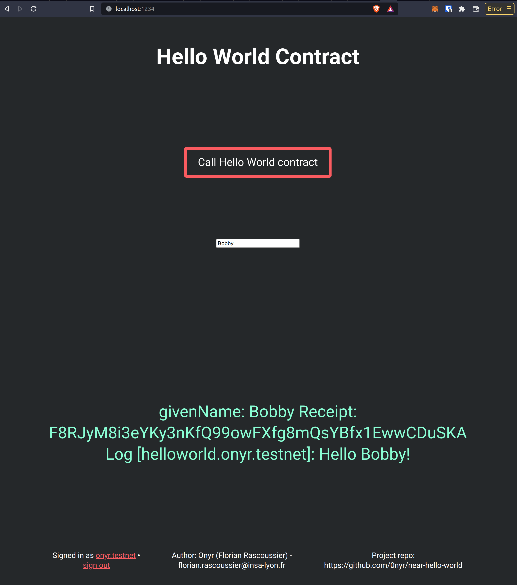

# Near 🗺 Hello World 🌎 contract

This is a simple Hello World smart contract. As explained by the [exercice instruction](https://nearvember.near.org/challenge-2-hello-world) : "When we call the contract, it should take a {name} parameter and return "Hello {name}!"

> This project was kickstarted using [this official NEAR template](https://github.com/near-examples/rust-template).

> This project front-end code is adapted from [NEAR official wallet example](https://github.com/near-examples/wallet-example)

### Useful links

[NEAR official wallet example](https://github.com/near-examples/wallet-example) ⭐️

[NEAR Front-End quick reference](https://docs.near.org/docs/api/naj-quick-reference)

### Commands

1. First, read the README inside `contract/` and deploy the contract.
2. Modify `CONTRACT_NAME` inside `src/main.js` with the sub-account where you deployed the contract (this is the contract name).
3. Download the library `npm i near-api-js` and `npm install -g parcel-bundler` for bundling code.
4. Run project `yarn start`. Go to the browser and enjoy the app.
